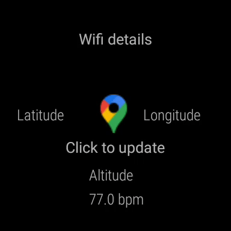

# CSE218 - Assignment 4
## WearOs app - Heart rate sensor
### Authors: Balaji Muthazhagan (UCSD), Shikha Dixit (UCSD)
___
The app has the following functionalities:
* Shows current latitude, longitude and altitude on screen
* Shows current Wifi strength and SSID
* Shows current heart rate
* Shows approximate number of steps based on Accelerometer data

  
The main functionality of the app is defined in `main/wear/src/main/java/CSE218/MainActivity.java`

The heart rate listener is defined in `main/wear/src/main/java/CSE218/HeartRateListener.java`

The heart rate listener is defined in `main/wear/src/main/java/CSE218/StepCountListener.java`
   

<b>Output capture without steps</b>  

<b>  Output capture with steps</b>  

